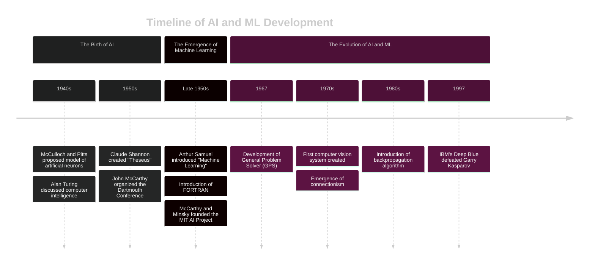

# Understanding the Concepts of AI, ML, and DL.
Everything I used in this presentation is available on github and on my website

---
![[chat-gpt2.png]]

---
## Congratulations! 

---
# AI in Today's World:
Everything is AI enabled

---
## Machine Vision / Computer Vision

---
# Examples of Computer Vision

- Facial Recognition
- Object Detection/Tracking
- Image Classification
- Optical Character Recognition
---
# Generative AI
![[Pasted image 20240502222619.png]]

---
### Large Language Model (LLM)

---
# OpenSource LLM
![[hf-logo-with-title.png]]
https://huggingface.co/models

---
### Text Generation Webui

---
## Text to Image

---

| Anime                              | Realistic                                       |
| ---------------------------------- | ----------------------------------------------- |
|  |  |

---

### AUTOMATIC1111's stable diffusion webui

----
# A Brief History of AI

---

---

# What is the Difference Between AI and Machine Learning?
*Source: [Pathmind.com](https://wiki.pathmind.com/ai-vs-machine-learning-vs-deep-learning)*

---

---
# Types of Machine Learning
Source: [Vijay Kanade - Spiceworks](https://www.spiceworks.com/tech/artificial-intelligence/articles/what-is-ml/)

---

---
## Supervised Learning

trained on labeled datasets

---
### Classification

classifying objects

---
### Regression

used to predict continuous values

---
## Unsupervised Learning

Deals with unlabeled data

---
### Clustering
a way of grouping similar data points together. 

---
### Association
discovering the relation between variables in large datasets.

---

## Reinforcement Learning
![[Reinforcement Learning.png]]
through trial and error

---

# Practical Examples

---
## MENACE The Matchbox who learned to play tic-tac-toe
---

---
### Neural networks
Structure of a Neural Network

---
### Components of a Neural Network:

1. **Neurons:** Neurons are the basic processing units of a neural network.
2. **Weights:** Weights represent the strength of connections between neurons. 
3. **Biases:** Biases provide flexibility to the neural network by shifting the activation function horizontally.

---
4. **Activation Functions:** Activation functions introduce non-linearity into the neural network, enabling it to learn complex patterns. 
5. **Loss Function:** The loss function measures the difference between the predicted output of the neural network and the actual output. 

 ---

### https://playground.tensorflow.org/
DEMO

---

# The Future of AI

---
For those interested in delving into AI
https://www.lesswrong.com/posts/FkDuWGtiCTshovoTN/list-of-links-for-getting-into-ai-safety
https://course.fast.ai/
---
privacy, fairness, transparency, accountability

---
Those entering the field have a responsibility to approach their work with integrity, empathy, and a commitment to ethical principles.

---
Everything I used in here is available on my website
circool.xyz